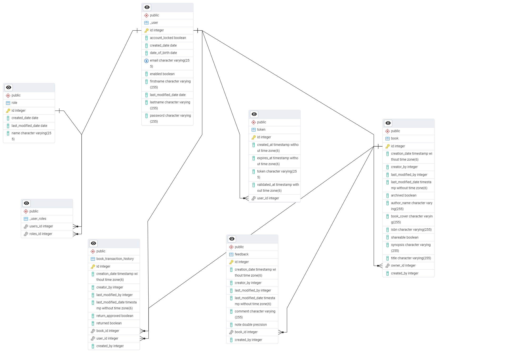

# Book Social Network

# Overview
**Book Social Network** is a full-stack application that enables users to manage their book collections and engage with a community of book enthusiasts. It offers features such as user registration, secure email validation, book management (including creation, updating, sharing, and archiving), book borrowing with checks for availability, book return functionality, and approval of book returns. The application ensures security using JWT tokens and adheres to best practices in REST API design. The backend is built with **Spring Boot 3** and **Spring Security 6**, while the frontend is developed using **Angular** with **Bootstrap** for styling.

## Features
- **User Registration:** Users can register for a new account.
- **Email Validation:** Accounts are activated using secure email validation codes.
- **User Authentication:** Existing users can log in to their accounts securely.
- **Book Management:** Users can create, update, share, and archive their books.
- **Book Borrowing:** Implements necessary checks to determine if a book is borrowable.
- **Book Returning:** Users can return borrowed books.
- **Book Return Approval:** Functionality to approve book returns.

### Class diagram

###  JWT-based authentication flow

## 1. User Request
- The client sends a request (GET, POST, PATCH, DELETE) to the server.

## 2. Filter Chain Execution
- The request passes through multiple filters.
- The `JwtAuthenticationFilter` (a `OncePerRequestFilter`) intercepts the request.

## 3. Token Validation
- The filter checks if a JWT token exists.
- If a token is found, it is validated by the `JwtService`.

## 4. User Authentication
- If the token is valid, `UserDetailsService` fetches the user based on the email.
- If the user is found, authentication details (principal, credentials, authorities) are stored in `SecurityContextHolder`.

## 5. Request Processing
- The authenticated request proceeds to the `DispatcherServlet`, which forwards it to the appropriate controller.

## 6. Error Handling
- If the token is invalid, a `TokenInvalidException` is thrown.
- If the user is not found, a `UserNotFoundException` is thrown.
- If authentication fails, the response is sent back with an error.

## 7. Successful Response
- If authentication is successful, the request is processed by a controller, and a response is returned to the client.